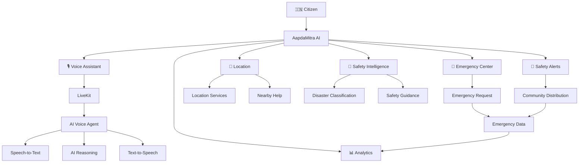

# 👥 Team

## Console Ninjas

**Team Console Ninjas** is building AapdaMitra AI for the Independence Day AI Hackathon.

### Team Members

| Name | Role |
|---|---|
| **Rishabh Kumar** | Co-Builder / Developer |
| **Ariba Rehman** | Co-Builder / Developer |

Together, we are building AapdaMitra AI — a voice-first disaster response assistant focused on **Voice AI, Security, and Virality** for safer communities across India.
# 🇮🇳 AapdaMitra AI

## Every Crisis. Every Voice. Every Indian.

**AapdaMitra AI** is a multilingual, voice-first AI disaster-response assistant designed to help people communicate, understand, and respond during emergencies.

It combines **Voice AI, Security, and Virality** into one public-safety experience — enabling people to speak naturally with an AI assistant, receive actionable disaster guidance, access location-aware assistance, initiate emergency workflows, and share safety information with their communities.

---

# 🏆 Independence Day AI Hackathon

**Industry:** Government

**Hackathon Themes:**

* 🎙️ Voice AI
* 🔐 Security
* 📢 Virality

AapdaMitra AI is designed specifically around the three core themes of the hackathon.

---

# 🚨 The Problem

During a disaster, people often face several problems at the same time:

* They don't know what action to take immediately.
* They may not be able to type quickly during a crisis.
* Language can become a major communication barrier.
* Emergency information can be scattered across multiple services.
* People may not know where the nearest safe shelter or emergency facility is.
* Important safety information may not reach nearby communities quickly.
* Sharing exact personal location publicly can create privacy risks.

In an emergency, the gap between:

> **"Something is wrong."**

and

> **"I know what to do next."**

can cost valuable time.

AapdaMitra AI is designed to reduce that gap.

---

# 💡 The Solution

AapdaMitra AI provides a conversational, voice-first emergency assistance experience.

A citizen can simply speak naturally:

> **"Mere area mein flood aa gaya hai."**

AapdaMitra can understand the situation and guide the user through an emergency-response flow:

```text
Citizen speaks
      ↓
Voice AI
      ↓
Understand the emergency
      ↓
Identify disaster type
      ↓
Provide immediate safety guidance
      ↓
Assist with location
      ↓
Find nearby help
      ↓
Emergency workflow
      ↓
Generate safety alert
      ↓
Share information with the community
```

The goal is to make emergency assistance **faster, more accessible, more understandable, and more connected.**

---

# 🎙️ Theme 1 — Voice AI

## Voice-first emergency assistance

Voice is the primary interaction model of AapdaMitra AI.

During emergencies, typing may be slow, difficult, or inaccessible. A user should be able to simply speak their situation.

The voice experience is designed around:

* Real-time voice conversation
* AI voice agent
* Speech-to-text
* AI reasoning
* Text-to-speech
* Live conversation transcript
* Audio visualization
* Voice connection status
* Multilingual interaction
* Accessibility-focused interaction

### Example

User:

> "Mere area mein flood aa gaya hai."

AapdaMitra:

> "Please move to higher ground and avoid fast-moving water. I can also help you find nearby safe locations."

This makes the AI assistant useful even when the user cannot comfortably type.

---

# 🔐 Theme 2 — Security

## Safer emergency experiences

Emergency applications can handle sensitive information such as:

* Location
* Emergency details
* User identity
* Conversation data
* Incident information

AapdaMitra AI is designed with privacy and security as first-class considerations.

### Security principles

* Server-side API secrets
* Environment-variable based configuration
* No API keys exposed to the client
* Location permission and consent
* Emergency-request validation
* Input validation
* Secure real-time communication architecture
* Privacy-aware safety alert generation
* Clear distinction between live and demo functionality
* Suspicious emergency-request detection architecture
* Audit logging architecture

### Privacy-first sharing

Public safety alerts should never expose:

* Exact private GPS coordinates
* Private user information
* Sensitive conversation content

AapdaMitra focuses on sharing **useful safety information**, not personal information.

---

# 📢 Theme 3 — Virality

## Turning one safety message into community awareness

During disasters, information is only useful if people receive it quickly.

AapdaMitra introduces a **Share Safety Alert** experience.

A user can generate a concise, multilingual safety message containing:

* Disaster type
* Severity
* General affected area
* Immediate safety instructions
* Emergency information
* Verification status
* Timestamp
* AapdaMitra branding

The alert can be prepared for community distribution.

### The idea

```text
One emergency
      ↓
One useful safety message
      ↓
Multilingual safety alert
      ↓
Community sharing
      ↓
More people informed
      ↓
Faster community response
```

This is not entertainment-driven virality.

It is **life-saving information distribution.**

> **AapdaMitra helps important safety information reach communities faster.**

---

# 🇮🇳 Independence Day Special

AapdaMitra AI is designed as an Independence Day Special experience.

The visual identity takes inspiration from the Indian national tricolor:

* 🟠 Saffron
* ⚪ White
* 🟢 Green

The design also uses subtle Ashoka Chakra-inspired visual elements.

The objective is not to create a festival-themed website.

Instead, the design represents:

**Technology serving people.**

**Innovation serving safety.**

**AI serving communities.**

### Mission

> **Every Crisis. Every Voice. Every Indian.**

---

# ✨ Key Features

## 🎙️ AI Voice Assistant

* Real-time voice interaction
* AI conversational agent
* Speech recognition
* Text-to-speech
* Live transcript
* Audio visualization
* Listening state
* Processing state
* Speaking state
* Connection status
* Multilingual interface

---

## 🌐 Multilingual Assistance

Designed for India's diverse language landscape.

Supported languages include:

* English
* हिंदी
* বাংলা
* मराठी
* தமிழ்

The architecture can be extended to additional Indian languages.

---

## 🚨 Emergency SOS

A dedicated emergency workflow allows users to initiate an SOS process.

The flow can include:

1. Emergency confirmation
2. Disaster type selection
3. Severity selection
4. Location permission
5. Location capture
6. Emergency request creation
7. Emergency status tracking

Possible states:

```text
READY
↓
CONFIRMATION
↓
LOCATING
↓
REQUEST CREATED
↓
SENT
↓
ACKNOWLEDGED
↓
RESOLVED
```

If a real emergency-dispatch integration is not configured, the system clearly identifies the flow as demo functionality.

**AapdaMitra never falsely claims that an emergency service was contacted.**

---

# 📍 Live Location & Nearby Help

AapdaMitra provides location-aware assistance.

Potential nearby services include:

* 🛟 Safe Shelters
* 🏥 Hospitals
* 👮 Police Stations
* 🚒 Fire Stations
* 🏕️ Relief Camps
* 🚨 Emergency Services

The experience is designed around user consent and privacy.

Where live location/service data is unavailable, demo data is clearly labelled rather than presented as real-time information.

---

# 🧠 AI Disaster Intelligence

AapdaMitra is designed to understand common emergency situations such as:

* 🌊 Flood
* 🌎 Earthquake
* 🔥 Fire
* 🌀 Cyclone
* ⛰️ Landslide
* ☀️ Heatwave
* ⚡ Lightning
* 🌊 Tsunami
* 🏥 Medical Emergency
* 🚨 General Emergency

The AI response can be structured around:

### Immediate Actions

What the user should do right now.

### Things to Avoid

Potentially dangerous actions or areas to avoid.

### Evacuation Guidance

Whether moving to a safer location may be appropriate.

### Emergency Assistance

Whether emergency services should be recommended.

---

# 🛡️ Safety Guidance

The Safety Center provides disaster-specific information.

For example:

### Flood

* Move to higher ground.
* Avoid fast-moving water.
* Stay away from electrical infrastructure.
* Do not attempt to cross flooded roads.

### Earthquake

* Drop, cover, and hold.
* Move away from windows.
* Avoid damaged structures.
* Follow official evacuation instructions.

### Fire

* Move away from smoke and flames.
* Follow safe evacuation routes.
* Avoid elevators where evacuation guidance requires stairs.
* Contact emergency services when necessary.

### Cyclone

* Stay indoors when advised.
* Stay away from windows.
* Follow official warnings.
* Keep emergency supplies accessible.

Safety guidance should remain concise, practical, and responsible.

---

# 📢 Safety Alerts

The Alerts experience provides a dedicated place for emergency information.

Each alert can include:

* Disaster
* Severity
* General affected area
* Timestamp
* Safety guidance
* Verification state

Possible states:

```text
VERIFIED
UNVERIFIED
SUSPICIOUS
```

Verification must only be claimed when an actual trusted verification source exists.

Demo alerts must be clearly identified as demo content.

---

# 📊 Analytics

AapdaMitra includes an analytics experience designed for emergency-response monitoring.

Potential metrics include:

* Emergency Requests
* Active Incidents
* Resolved Incidents
* People Assisted
* Average Response Time
* Alerts Generated
* Alerts Shared
* Estimated Community Reach

Analytics can include:

* Emergency requests over time
* Disaster-type distribution
* Severity distribution
* Language usage
* Response status
* Community alert sharing

Live operational data and demo data must always be clearly distinguished.

---

# 🗺️ Product Pages

AapdaMitra is designed as a multi-page application rather than putting every feature into one dashboard.

### `/`

**Home**

Product introduction, Independence Day branding, assistant overview, quick actions and system status.

### `/assistant`

**AI Voice Assistant**

Real-time voice interaction, transcript, audio visualization and multilingual assistance.

### `/emergency`

**Emergency Center**

SOS workflow, incident type, severity, location and emergency status.

### `/location`

**Live Location & Nearby Help**

Map, current location, shelters, hospitals, police, fire and relief facilities.

### `/safety`

**Safety Center**

Disaster-specific safety instructions and emergency guidance.

### `/alerts`

**Disaster Alerts**

Emergency information, verification states and Share Safety Alert.

### `/analytics`

**Analytics**

Emergency, response and community-distribution metrics.

### `/settings`

**Settings**

Language, voice, privacy, location and user preferences.

---

# 🏗️ Architecture



---

# 🛠️ Technology Stack

## Frontend

* Next.js
* React
* TypeScript
* Tailwind CSS
* shadcn/ui
* Framer Motion
* Lucide Icons

## Voice AI

* LiveKit
* LiveKit Agents
* Murf AI
* Speech-to-Text
* AI conversational agent

## Backend

* Python
* LiveKit Agents
* API services
* Emergency-response service abstractions

## Location

* Browser Geolocation API
* OpenStreetMap / map integration

## Analytics

* Recharts
* API-driven data architecture

---

# 📁 Project Structure

```text
AapdaMitra-AI/
│
├── backend/
│   ├── src/
│   │   └── agent.py
│   ├── tests/
│   ├── pyproject.toml
│   ├── railway.toml
│   └── .env.example
│
├── frontend/
│   ├── app/
│   │   ├── assistant/
│   │   ├── emergency/
│   │   ├── location/
│   │   ├── safety/
│   │   ├── alerts/
│   │   ├── analytics/
│   │   ├── settings/
│   │   ├── api/
│   │   └── page.tsx
│   │
│   ├── components/
│   │   ├── agents-ui/
│   │   ├── ai-elements/
│   │   ├── app/
│   │   └── ui/
│   │
│   ├── hooks/
│   ├── lib/
│   ├── public/
│   └── package.json
│
├── start_app.sh
├── start_app.ps1
├── AGENTS.md
├── LICENSE
└── README.md
```

---

# 🚀 Getting Started

## Prerequisites

Install:

* Node.js 18+
* pnpm
* Python 3.10+
* uv
* LiveKit project
* Required AI/voice credentials

---

## 1. Clone the repository

```bash
git clone <your-repository-url>
cd AapdaMitra-AI
```

---

## 2. Backend

```bash
cd backend
uv sync
```

Create your environment file:

```bash
cp .env.example .env
```

Add the required backend credentials.

Then return to the root:

```bash
cd ..
```

---

## 3. Frontend

```bash
cd frontend
pnpm install
```

Create the local environment file:

```bash
cp .env.example .env.local
```

Configure the required LiveKit values.

---

## 4. Run locally

From the `frontend` directory:

```bash
pnpm dev
```

Open:

```text
http://localhost:3000
```

---

# 🎙️ Environment Configuration

The frontend uses LiveKit configuration similar to:

```env
LIVEKIT_URL=
LIVEKIT_API_KEY=
LIVEKIT_API_SECRET=
AGENT_NAME=
```

Keep all secrets private.

Never commit:

```text
.env
.env.local
.env.*.local
```

Only safe example configuration should be committed:

```text
.env.example
```

---

# 🔐 Security Guidelines

AapdaMitra follows these principles:

### Never expose secrets

API keys and private credentials must remain server-side.

### Location requires consent

The application should request permission before accessing browser location.

### Protect private information

Private user information should never be included in public safety alerts.

### Don't fake emergency actions

The application must never claim that:

* Police were contacted
* Ambulance was dispatched
* Fire services were notified
* Government authorities verified an alert

unless the real integration actually performed that action.

### Demo data must be labelled

Mock locations, statistics, alerts and emergency states should be clearly identified.

---

# 🧪 Hackathon Demo Mode

AapdaMitra is designed to provide a reliable hackathon demonstration even when every production integration is not available.

Recommended demo:

```text
1. Open AapdaMitra
        ↓
2. Select Hindi
        ↓
3. Start Voice Assistance
        ↓
4. Say:
   "Mere area mein flood aa gaya hai."
        ↓
5. Show live transcript
        ↓
6. Show flood understanding
        ↓
7. Show immediate safety guidance
        ↓
8. Open Emergency Center
        ↓
9. Start Demo SOS
        ↓
10. Show location assistance
        ↓
11. Find nearby shelter
        ↓
12. Open Safety Center
        ↓
13. Generate Safety Alert
        ↓
14. Share multilingual alert
        ↓
15. Open Analytics
        ↓
16. Show community reach
```

---

# 🎬 Recommended Judge Presentation

Start with the problem, not the technology.

### Opening

> "During a disaster, people don't need another complicated application. They need someone—or something—that understands them immediately."

Then demonstrate:

### Step 1 — Voice

Speak naturally:

> "Mere area mein flood aa gaya hai."

### Step 2 — Intelligence

Show that AapdaMitra understands the disaster and provides immediate guidance.

### Step 3 — Emergency

Show the SOS workflow.

### Step 4 — Location

Show nearby help.

### Step 5 — Security

Show location consent and privacy-aware handling.

### Step 6 — Virality

Generate a multilingual safety alert and demonstrate how it can reach a community.

### Step 7 — Analytics

Show the impact and response metrics.

---

# 🎯 Why This Product Matters

AapdaMitra is built around a simple idea:

> **In a crisis, information should be fast, understandable, accessible, and safe.**

The platform combines:

```text
Voice
  +
AI
  +
Safety
  +
Location
  +
Security
  +
Community Distribution
```

into one experience.

---

# 🌍 Impact

AapdaMitra aims to improve the time between:

**Emergency detected**

and

**Action understood.**

It can help reduce barriers caused by:

* Language
* Accessibility
* Information overload
* Lack of local guidance
* Difficulty communicating during emergencies

The platform is designed to support citizens while keeping privacy, safety, and responsible AI use at the center.

---

# 🔮 Future Roadmap

Future versions can integrate:

### Government & Disaster Systems

* Official disaster-warning feeds
* Government emergency systems
* Verified emergency alerts
* Official relief-camp information

### Real-Time Intelligence

* Weather intelligence
* Flood monitoring
* Cyclone tracking
* Earthquake information
* Disaster-risk analysis

### Emergency Response

* Responder dashboards
* Live incident management
* Shelter capacity
* Emergency team coordination

### Accessibility

* More Indian languages
* Voice-first accessibility
* Low-bandwidth mode
* Offline emergency guidance
* Accessibility support for users with disabilities

### Security

* Strong authentication
* Role-based access
* Advanced fraud detection
* Suspicious SOS detection
* Audit trails
* Privacy-preserving location intelligence

---

# 🏆 Hackathon Theme Mapping

| Hackathon Theme  | AapdaMitra AI                                                             |
| ---------------- | ------------------------------------------------------------------------- |
| 🎙️ **Voice AI** | Real-time conversational disaster assistant                               |
| 🔐 **Security**  | Privacy-aware location, secure architecture and emergency-data protection |
| 📢 **Virality**  | Multilingual Safety Alerts and community information distribution         |

---

# 📌 Project Information

**Project:** AapdaMitra AI

**Tagline:**
**Every Crisis. Every Voice. Every Indian.**

**Industry:**
Government / Public Safety

**Themes:**
Voice AI · Security · Virality

**Repository:**
`Rishabh-KSingh/AapdaMitra-AI`

**Local Development:**
`http://localhost:3000`

---

# ❤️ Our Mission

AapdaMitra AI is built with one mission:

> ## **Make emergency assistance more accessible, understandable, secure, and human — for every Indian.**

### 🇮🇳 Every Crisis. Every Voice. Every Indian.
